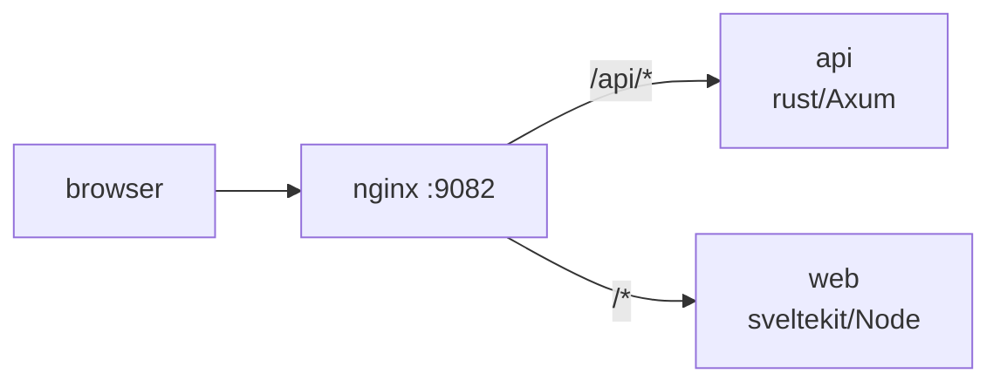

<div align="center">
    
    <br/>
    <a href="https://osrx.loverinsyach.site">
        osrx.loverinsyach.site
    </a>
    <br/>
    <br/>
    <br/>
</div>

inspect, edit, and rewrite osu! replay metadata directly in your browser.

## features

- parse and inspect `.osr` replay metadata
- edit replay statistics and player information
- configure stable and lazer mods
- export modified replay files
- fully browser-based workflow

## installation

```sh
git clone https://github.com/remeliah/osrx.git
cd osrx

make setup

make build
make run
```

the app will be available at `http://localhost:9082`.

## development

requires rust and node.js 22+.

```sh
# start API + frontend dev servers
make dev

# or run them separately:
cargo run -p osrx-api          # API on :3001
cd web && npm run dev          # web on :3000 (proxies /api to :3001)
```

## architecture



the rust API uses [`osr-rs`](https://crates.io/crates/osr-rs) to parse and serialize `.osr` binaries. the frontend is a Svelte 5 app that talks to two endpoints:

| endpoint | method | description |
| --- | --- | --- |
| `/api/parse` | POST | upload `.osr` as multipart, get JSON with all replay metadata + base64-encoded raw bytes |
| `/api/write` | POST | send modified JSON, get back the binary `.osr` file as a download |

## configuration

| variable | default | description |
| --- | --- | --- |
| `WEB_PORT` | `3000` | sveltekit dev / node server port |
| `API_PORT` | `3001` | rust API server port |
| `NGINX_PORT` | `9082` | public-facing port |

set these in `.env` or directly in the environment.

## License

MIT
